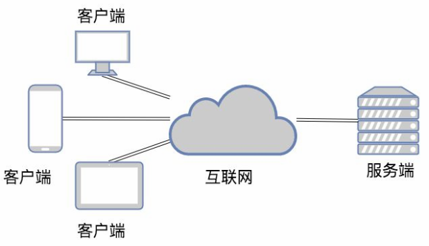
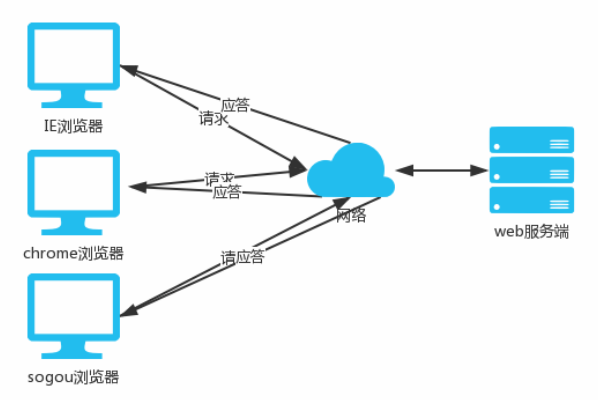
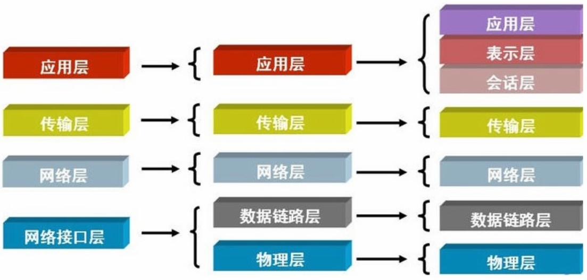
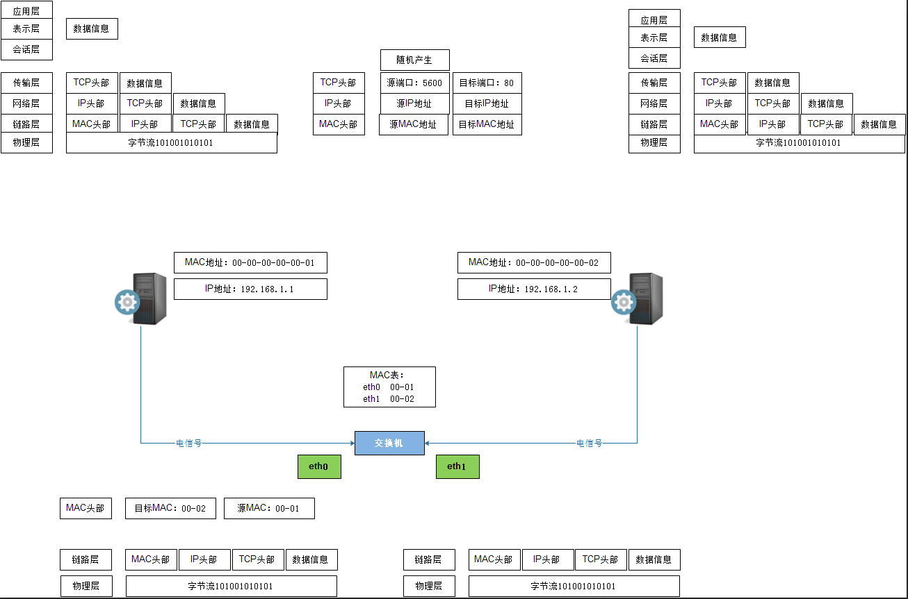
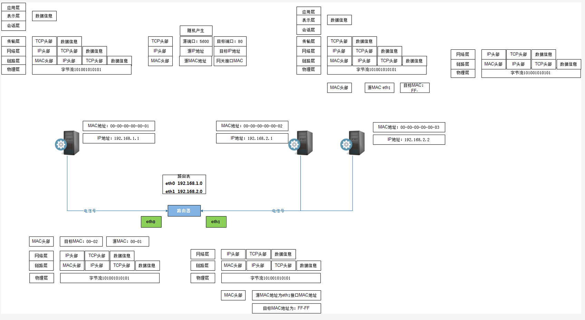

### 网络开发的两大架构
```
c/s 架构 : client  server
B/S 架构 : Brower  server

(1)bs 和 cs 架构之间的关系?
(2)哪一种架构更好呢?
```
1.c/s 架构



2.B/S 架构



### 基础概念

```
#一台主机有两个重要标识:
(1)mac地址:标记一台机器的物理地址  (不可变)
(2)ip 地址:#标记一台机器的逻辑地址 (可变)

	IP地址是指互联网协议地址（英语：Internet Protocol Address，又译为网际协议地址），是IP Address的缩写。IP地址是IP协议提供的一种统一的地址格式，它为互联网上的每一个网络和每一台主机分配一个逻辑地址，以此来屏蔽物理地址的差异。ip地址分为两种 ipv4 和 ipv6：
	 #分类ipv4 和 ipv6：	
	ipv4地址是一个32位的二进制数
	ipv6地址是一个128位的二进制数
    
    ipv4:  以4段点分十进制表示   X.X.X.X  => 范围
        0.0.0.0 ~ 255.255.255.255 地址范围2^32-1
    ipv6 : 以8段冒分十六进制表示 X:X:X:X:X:X:X:X => 范围
        0:0:0:0:0:0:0:0 ~ FFFF:FFFF:FFFF:FFFF:FFFF:FFFF:FFFF:FFFF 地址范围2^128-1
    ip地址的最后一位0或者255 两个数字不能用，一般最后一位0表达的是网段，255代表广播地址

#网段 : 网段的作用,主要用来划分同一区域里的某些机器是否能够互相通信。在一个网段里可以不同过因特网,直接对话
       判别的依据：如果IP地址和子网掩码相与得到的值相同就是同一网段	   
	   
#内网 : 以下地址为预留地址，永远不会被当做公网ip来分配
    192.168.0.0 - 192.168.255.255
    172.16.0.0 - 172.31.255.255
    10.0.0.0 - 10.255.255.255
    
#外网 :
	在任何地方都可以访问的就是外网(排除防火墙的因素)
	
#子网掩码:区分网段和主机
	255.255.255.0   / 255.255.0.0 /  255.0.0.0
	ip1:192.168.10.12  ip2:192.168.1.16
	
#端口:"端口"是英文port的意译,是具体某个程序与外界通讯的出口。 取值范围:0~65535 
      使用时至少8000以上    访问地址加端口:192.168.2.1:8000
      
#局域网:在同一区域内由多台计算机互联形成通讯。【具有可重复的内网ip】
#广域网:在不同区域内有多台计算机互联形成通讯。【具有唯一的公网ip】
#交换机:对同一网段的不同机器之间进行数据转发的设备     [每一台机器和交换机相连,形成通信]
#路由器:对不同网段的不同机器之间进行数据转发的设备     [每一个局域网和路由器相连,形成通信]

#arp协议:每台主机都有通过ip找mac的一个协议规则 
       【实现方式：通过交换机一次广播,一次单播找到的】
```
### osi七层模型
```
人们按照分工不同把互联网协议从逻辑上划分了层级: osi4层,osi5层,osi7层 三类模型
```



### 局域网模型
```
局域网内,各个主机的通讯
```


### 广域网模型
```
广域网内,各个主机的通讯
```
