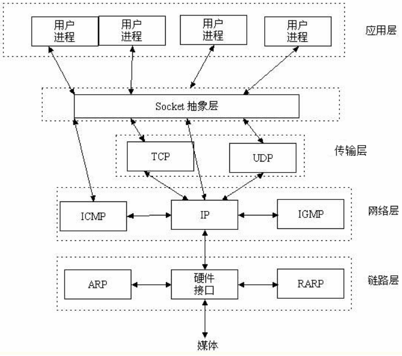

### TCP/UDP协议:  
```
TCP（Transmission Control Protocol）一种面向连接的、可靠的、传输层通信协议(比如:打电话)
优点:可靠，稳定,传输完整稳定,不限制数据大小
缺点:慢，效率低，占用系统资源高，一发一收都需要对方确认
应用：Web浏览器,电子邮件,文件传输,大量数据传输的场景

UDP（User Datagram Protocol）一种无连接的,不可靠的传输层通信协议(比如:发短信)
优点:速度快,可以多人同时聊天,耗费资源少,不需要建立连接
缺点:不稳定,不能保证每次数据都能接收到
应用：IP电话,实时视频会议,聊天软件,少量数据传输的场景

客户端和服务端在建立连接时: 三次握手
客户端和服务端在断开连接时: 四次挥手
SYN 创建连接
ACK 确认响应
FIN 断开连接
```
### 三次握手:


### 四次挥手:
```
MSL为最大报文段生存时间
默认规定MSL为2分钟，但实际应用中常用的是30秒，1分钟和2分钟等。
```

### 整体缩略图


### socket 

```
socket的意义:网络通信过程中,信息拼接的工具(中文:套接字)
# 开发中,一个端口只对一个程序生效,在测试时,允许端口重复捆绑 (开发时删掉)
# 在bind方法之前加上这句话，可以让一个端口重复使用
sk.setsockopt(socket.SOL_SOCKET,socket.SO_REUSEADDR,1)
```

### 黏包 
```
# tcp协议在发送数据时,会出现黏包现象.	
    (1)数据粘包是因为在客户端/服务器端都会有一个数据缓冲区，
    缓冲区用来临时保存数据，为了保证能够完整的接收到数据，因此缓冲区都会设置的比较大。
    (2)在收发数据频繁时，由于tcp传输消息的无边界,不清楚应该截取多少长度
    导致客户端/服务器端,都有可能把多条数据当成是一条数据进行截取，造成黏包
```
### 黏包出现的两种情况 
```
#黏包现象一:
	在发送端,由于两个数据短,发送的时间隔较短,所以在发送端形成黏包
#黏包现象二:
	在接收端,由于两个数据几乎同时被发送到对方的缓存中,所有在接收端形成了黏包
#总结:
    发送端,包之间时间间隔短 或者 接收端,接受不及时, 就会黏包
    核心是因为tcp对数据无边界截取,不会按照发送的顺序判断
```
### 黏包对比:tcp和udp
```
#tcp协议:
优点:接收时数据之间无边界,有可能粘合几条数据成一条数据,造成黏包 
缺点:不限制数据包的大小,稳定传输不丢包

#udp协议:
优点:接收时候数据之间有边界,传输速度快,不黏包
缺点:限制数据包的大小(受带宽路由器等因素影响),传输不稳定,可能丢包

#tcp和udp对于数据包来说都可以进行拆包和解包,理论上来讲,无论多大都能分次发送
但是tcp一旦发送失败,对方无响应(对方无回执),tcp可以选择再发,直到对应响应完毕为止
而udp一旦发送失败,是不会询问对方是否有响应的,如果数据量过大,易丢包
```
### 解决黏包问题
```
#解决黏包场景:
	应用场景在实时通讯时,需要阅读此次发的消息是什么
#不需要解决黏包场景:
	下载或者上传文件的时候,最后要把包都结合在一起,黏包无所谓.
```
### 模块 socketserver 
```
#网络协议的最底层就是socket,基于原有socket模块,又封装了一层,就是socketserver
socketserver 为了实现tcp协议,server端的并发.
```
### socket参数的详解
```
socket.socket(family=AF_INET,type=SOCK_STREAM,proto=0,fileno=None)
创建socket对象的参数说明如下：
```
| **family** | 地址系列应为AF_INET(默认值), AF_INET => ipv4<br />AF_INET6, => ipv6<br />AF_UNIX,AF_CAN或AF_RDS.（AF_UNIX 域实际上是使用本地 socket [文件]来通信）同一机器 |
| ---------- | ------------------------------------------------------------ |
| **type**   | 套接字类型应为SOCK_STREAM(默认值),SOCK_DGRAM,SOCK_RAW或其他SOCK_常量之一。 **SOCK_STREAM** 是基于TCP的，有保障的（即能保证数据正确传送到对方）面向连接的SOCKET，多用于资料传送。  **SOCK_DGRAM** 是基于UDP的，无保障的面向消息的socket，多用于在网络上发广播信息。 |
| **proto**  | 协议号通常为零,可以省略,或者在地址族为AF_CAN的情况下,协议应为CAN_RAW或CAN_BCM之一。 |
| **fileno** | 如果指定了fileno,则其他参数将被忽略,导致带有指定文件描述符的套接字返回。 与socket.fromfd()不同,fileno将返回相同的套接字,而不是重复的。 这可能有助于使用socket.close()关闭一个独立的插座。 |

### socket的更多方法介绍(了解)
```
服务端套接字函数
s.bind()    绑定(主机,端口号)到套接字
s.listen()  开始TCP监听
s.accept()  被动接受TCP客户的连接,(阻塞式)等待连接的到来

客户端套接字函数
s.connect()     主动初始化TCP服务器连接
s.connect_ex()  connect()函数的扩展版本,出错时返回出错码,而不是抛出异常
(等价于:异常处理+connect 一旦网络不通,作用:返回错误号而不是直接报错)

公共用途的套接字函数
s.recv()            接收TCP数据
s.send()       发送TCP数据,send返回值是发送的[字节数量],这个值可能小于要发送的string字节数
s.sendall()    发送TCP数据,sendall返回值是None,发送string所有数据
'''
# 下面两个代码等价:
    #sendall => sock.sendall('Hello world\n')
    #send => buffer = 'Hello world\n'
             while buffer:
        		n = sock.send(buffer)
        		buffer = buffer[n:] (切片)
'''
s.recvfrom()        接收UDP数据
s.sendto()          发送UDP数据
s.getpeername()     连接到当前套接字的远端的地址
s.getsockname()     当前套接字的地址
s.getsockopt()      返回指定套接字的参数
s.setsockopt()      设置指定套接字的参数
s.close()           关闭套接字

面向锁的套接字方法
s.setblocking()     设置套接字的阻塞与非阻塞模式
s.settimeout()      设置阻塞套接字操作的超时时间
s.gettimeout()      得到阻塞套接字操作的超时时间

面向文件的套接字的函数
s.fileno()          套接字的文件描述符
s.makefile()        创建一个与该套接字相关的文件

更多方法
```
### hashlib模块
```
#hashlib 这个模块是一堆加密算法的集合体,哈希算法的加密方式不止一种
https://www.cmd5.com/ md5解密
# 应用场景:在需要效验功能时使用
    用户密码的 => 加密,解密
    相关效验的 => 加密,解密

#哈希算法也叫摘要算法,相同的数据始终得到相同的输出,不同的数据得到不同的输出。
#(1)哈希将不可变的任意长度的数据,变成具有固定长度的唯一值	
 (2)字典的键值对映射关系是通过哈希计算的,哈希存储的数据是散列(无序)	
```
