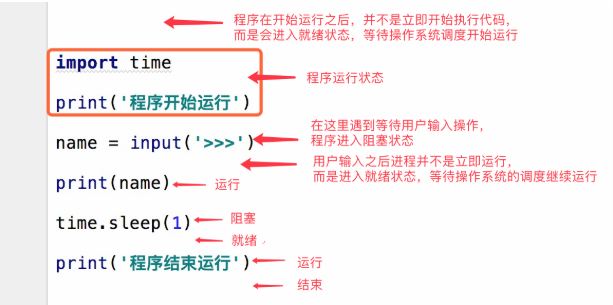
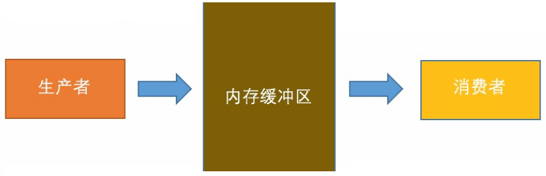

### 进程的概念:(Process)
```
进程就是正在运行的程序,它是操作系统中,资源分配的最小单位.
资源分配:分配的是cpu和内存等物理资源
进程号是进程的唯一标识

同一个程序执行两次之后是两个进程
进程和进程之间的关系: 数据彼此隔离,通过socket通信
```
### 并行和并发
```
并发:一个cpu同一时间不停执行多个程序
并行:多个cpu同一时间不停执行多个程序
```
### cpu的进程调度方法
```
# 先来先服务fcfs(first come first server):先来的先执行
# 短作业优先算法:分配的cpu多,先把短的算完
# 时间片轮转算法:每一个任务就执行一个时间片的时间.然后就执行其他的.
# 多级反馈队列算法

越是时间长的,cpu分配的资源越短,优先级靠后
越是时间短的,cpu分配的资源越多
```
### 进程三状态图


```
(1)就绪(Ready)状态
	只剩下CPU需要执行外,其他所有资源都已分配完毕 称为就绪状态。
(2)执行(Running)状态
	cpu开始执行该进程时称为执行状态。
(3)阻塞(Blocked)状态
	由于等待某个事件发生而无法执行时,便是阻塞状态,cpu执行其他进程.例如，等待I/O完成input、申请缓冲区不能满足等等。	
```



### 同步 异步 / 阻塞 非阻塞
```
场景在多任务当中
同步:必须等我这件事干完了,你在干,只有一条主线,就是同步
异步:没等我这件事情干完,你就在干了,有两条主线,就是异步
阻塞:比如代码有了input,就是阻塞,必须要输入一个字符串,否则代码不往下执行
非阻塞:没有任何等待,正常代码往下执行.
 
# 同步阻塞  :效率低,cpu利用不充分
# 异步阻塞  :比如socketserver,可以同时连接多个,但是彼此都有recv
# 同步非阻塞:没有类似input的代码,从上到下执行.默认的正常情况代码
# 异步非阻塞:效率是最高的,cpu过度充分,过度发热
```
### 守护进程
```
#可以给子进程贴上守护进程的名字,该进程会随着主进程代码执行完毕而结束(为主进程守护)
(1)守护进程会在主进程代码执行结束后就终止
(2)守护进程内无法再开启子进程,否则抛出异常(了解)
```
### 锁(Lock)
```
lock.acquire()# 上锁
lock.release()# 解锁

#同一时间允许一个进程上一把锁 就是Lock
	加锁可以保证多个进程修改同一块数据时，同一时间只能有一个任务可以进行修改，即串行的修改，没错，速度是慢了，但牺牲速度却保证了数据安全。
#同一时间允许多个进程上多把锁 就是[信号量Semaphore]
	信号量是锁的变形: 实际实现是 计数器 + 锁,同时允许多个进程上锁	

# 互斥锁Lock : 互斥锁就是进程的互相排斥,谁先抢到资源,谁就上锁改资源内容,为了保证数据的同步性
# 注意:多个锁一起上,不开锁,会造成死锁.上锁和解锁是一对.
```
### 事件(Event)
```
# 阻塞事件 ：
	e = Event()生成事件对象e   
	e.wait()动态给程序加阻塞 , 程序当中是否加阻塞完全取决于该对象中的is_set() [默认返回值是False]
    # 如果是True  不加阻塞
    # 如果是False 加阻塞

# 控制这个属性的值
    # set()方法     将这个属性的值改成True
    # clear()方法   将这个属性的值改成False
    # is_set()方法  判断当前的属性是否为True  (默认上来是False)
```
### 进程间通信 IPC
```
# IPC Inter-Process Communication
# 实现进程之间通信的两种机制:
    # 管道 Pipe
    # 队列 Queue
    
# put() 存放
# get() 获取
# get_nowait() 拿不到报异常
# put_nowait() 非阻塞版本的put
q.empty()      检测是否为空  (了解)
q.full() 	   检测是否已经存满 (了解)
```
### 生产者与消费者模型



### 进程池
```
# 进程池:
# 开启过多的进程并不一定提高你的效率,
# 如果cpu负载任务过多,平均单个任务执行的效率就会低,反而降低执行速度.
    1个人做4件事,4个人做4件事,4个人做1件事
    显然后者执行速度更快,
    前者是并发,后者是并行
    利用进程池,可以开启cpu的并行效果
# apply       开启进程,同步阻塞,每次都要等待当前任务完成之后,在开启下一个进程
# apply_async 开启进程,异步非阻塞,(主进程 和 子进程异步)
```

### 线程
```
#进程是资源分配的最小单位
#线程是计算机中调度的最小单位

#线程的缘起
资源分配需要分配内存空间,分配cpu:
分配的内存空间存放着临时要处理的数据等,比如要执行的代码,数据
而这些内存空间是有限的,不能无限分配
目前配置高的主机,5万个并发已是上限.线程概念应用而生.

#线程的特点
线程是比较轻量级,能干更多的活,一个进程中的所有线程资源是共享的.
一个进程至少有一个线程在工作
```
### 线程的缺陷
```
#线程可以并发,但是不能并行(同一个进程下的多个线程不能分开被多个cpu同时执行)
#原因:
   python是解释型语言,执行一句编译一句,而不是一次性全部编译成功,不能提前规划,都是临时调度
   容易造成不同的cpu却反复执行同一个程序.所以加了一把锁叫GIL
   全局解释器锁(Cpython解释器特有) GIL锁:同一时间,一个进程下的多个线程只能被一个cpu执行	
	
#想要并行的解决办法:
    (1)用多进程间接实现线程的并发
    (2)换一个Pypy,Jpython解释器

#程序分为计算密集型和io密集型
	对于计算密集型程序会过度依赖cpu,但网页,爬虫,OA办公,这种io密集型的程序里,python绰绰有余
```
### 线程相关函数
```
线程.is_alive()    检测线程是否仍然存在
线程.setName()     设置线程名字
线程.getName()     获取线程名字
1.currentThread().ident 查看线程id号 
2.enumerate()        返回目前正在运行的线程列表
3.activeCount()      返回目前正在运行的线程数量
```
### 死锁,递归锁,互斥锁
```
加一把锁,就对应解一把锁.形成互斥锁.
从语法上来说,锁可以互相嵌套,但不要使用,
不要因为逻辑问题让上锁分成两次.导致死锁
递归锁用于解决死锁,但只是一种应急的处理办法
```
### 线程队列
```
线程常用队列有 queue LifoQueue PriorityQueue
queue 先进先出
LifoQueue 后进先出
PriorityQueue 按照优先级排序
```
### 线程池和进程池 (改良版)
```
# 线程池
    # 实例化线程池      ThreadPoolExcutor    (推荐5*cpu_count)
    # 异步提交任务      submit / map
    # 阻塞直到任务完成   shutdown
    # 获取子线程的返回值 result
    # 使用回调函数      add_done_callback
 
# 回调函数
    就是一个参数,将这个函数作为参数传到另一个函数里面.
    函数先执行,再执行当参数传递的这个函数,这个参数函数是回调函数

# 线程池 是由子线程实现的
# 进程池 是由主进程实现的    
```
### 协程(gevent)
```
3.#协程也叫纤程: 协程是线程的一种实现.
    指的是一条线程能够在多任务之间来回切换的一种实现.
    对于CPU、操作系统来说,协程并不存在.
    任务之间的切换会花费时间.
    目前电脑配置一般线程开到200会阻塞卡顿.
    
#协程的实现
协程帮助你记住哪个任务执行到哪个位置上了，并且实现安全的切换
一个任务一旦阻塞卡顿,立刻切换到另一个任务继续执行,保证线程总是忙碌的,更加充分的利用CPU，抢占更多的时间片
# 一个线程可以由多个协程来实现,协程之间不会产生数据安全问题

#协程模块
    # greenlet  gevent的底层，协程，切换的模块
    # gevent    直接用的，gevent能提供更全面的功能

```