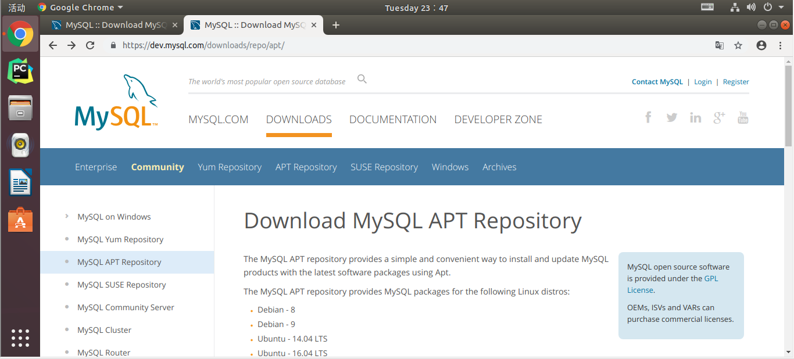
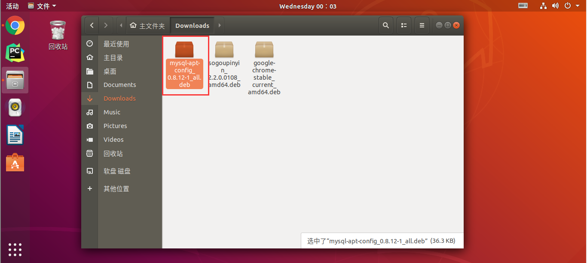
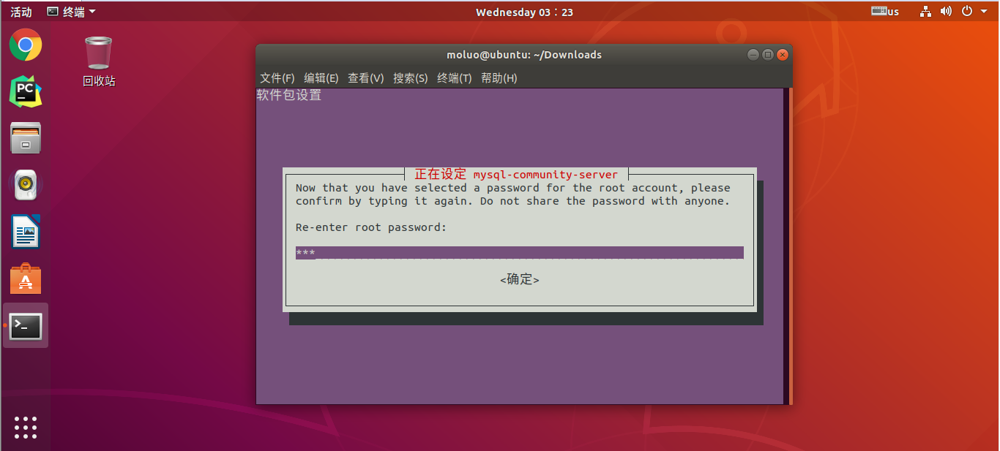
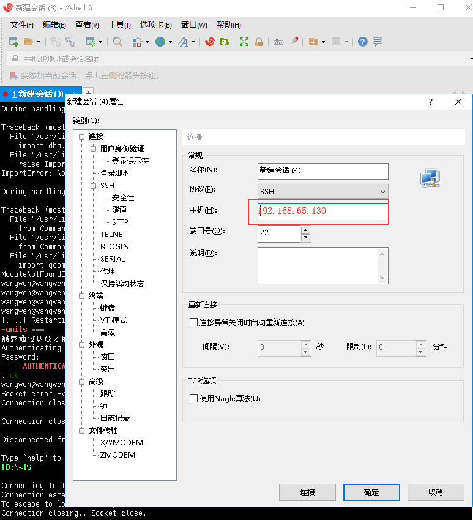

### ubuntu安装mysql

从官方提供的mysql-apt-config.deb包进行APT源设置

APT源下载地址：https://dev.mysql.com/downloads/repo/apt/




下载完成以后，默认apt源保存在了Downloads目录下。




通过终端切换目录到Downloads目录下执行一下命令：

```bash
cd Downloads/
sudo dpkg -i mysql-apt-config_0.8.12-1_all.deb 
```


按下方向键选择OK回车即可


完成后运行更新命令：

```
sudo apt-get update
```


```
sudo apt-get install mysql-server
```


设置root账号的登录密码：





经过上面操作，就完成了数据库的安装和配置。


```

### linux 安装mysql5.7
启动mysql：
方式一：sudo /etc/init.d/mysql start 
方式二：sudo service mysql start

停止mysql：
方式一：sudo /etc/init.d/mysql stop 
方式二：sudo service mysql stop

重启mysql：
方式一：sudo/etc/init.d/mysql restart
方式二：sudo service mysql restart


### windows安装mysql5.7
(1) 在D:\MySQL5.7\mysql-5.7.25-winx64文件下创建一个my.ini文件
以下部分可以黏贴: 但是要注意路径,除非你和我的一模一样.
[mysql]
# 设置mysql客户端默认字符集
default-character-set=utf8
[mysqld]
# 设置3306端口
port = 3306
# 设置mysql的安装目录
basedir=D:\MySQL5.7\mysql-5.7.25-winx64
# 设置mysql数据库的数据的存放目录
datadir=D:\MySQL5.7\mysql-5.7.25-winx64\data
# 允许最大连接数
max_connections=200
# 服务端使用的字符集默认为8比特编码的latin1字符集
character-set-server=utf8
# 创建新表时将使用的默认存储引擎
default-storage-engine=INNODB
# timestamp类型的字段,更改数据时,自动更新.
explicit_defaults_for_timestamp=true

以管理员身份运行cmd，进入bin目录，执行:
(2)初始化,创建mysql默认的root账户
mysqld --initialize-insecure --user=mysql 命令。不进行这一步，安装完成之后无法启动服务。
(3)依然在管理员cmd窗口的bin目录下，执行 mysqld install  命令安装。完成后会提示安装成功。
(4)依然在管理员cmd窗口的bin目录下，执行 net start mysql 命令启动MySQL服务。
(5)修改环境变量，添加"D:\MySQL5.7\mysql-5.7.25-winx64\bin"。
(6)cmd窗口中,执行 mysql -uroot -p 命令，默认没有密码，回车进入
(7)若要卸载,需要先停止服务,再删除即可

# 启动mysql服务
net start mysql
# 停止mysql服务
net stop mysql 
# 重启:先停止在启动


```

### 1.使用xshell连接ubuntu
```linux
1.sudo apt-get update  更新最新的软件包地址到缓存文件
2.安装 ssh 服务， 执行 apt-get install openssh-server 命令
3.检查ssh  服务是否启动， 执行 ps -e | grep ssh 命令
4.使用xshell 连接 ubuntu
```
(1)先通过ifconfig 查看自己的ip


(2)xshell文件->新建



然后写上自己的账号和密码: 账户:wangwen  密码:123456  -> 登录成功~


### 2.使用Navicat连接ubuntu

```
1.首先sudo ufw status查看防火墙是否开启，状态为inactive说明没有开启防火墙。
```

```
2.然后输入netstat -an|grep 3306查看端口启动和占用情况，可以看到绑定为127.0.0.1，这块需要我们修改为0.0.0.0，下面会讲到。
```


```
3.首先得修改mysql访问权限，输入mysql -u root -p，回车，然后输入密码123456进入mysql命令行。
```


```
4.输入grant all privileges on *.* to 'root'@'%' identified by '123456' with grant option;
      授予  所有    权限    给 库名.表名 to 用户@ip地址  通过密码"123456" 确认连接
指定所有客户端都可以使用root账户访问mysql。
```

```
5.输入flush privileges; 立刻刷新权限生效
```


```
6.输入exit;退出mysql命令行。
```


```
7.输入cd /etc/mysql/mysql.conf.d进入mysql配置目录 
```


```
8.输入nano mysqld.cnf修改mysql配置文件。
找到bind-address修改127.0.0.1为0.0.0.0。
```

```
9.输入sudo /etc/init.d/mysql restart 重启mysql
```


```
10.打开Navicat 文件 -> 新建连接 -> MySql
```


