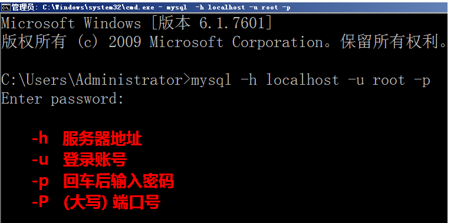
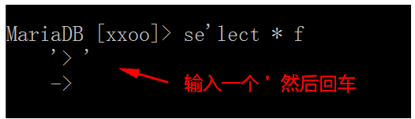
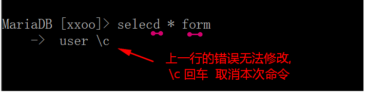
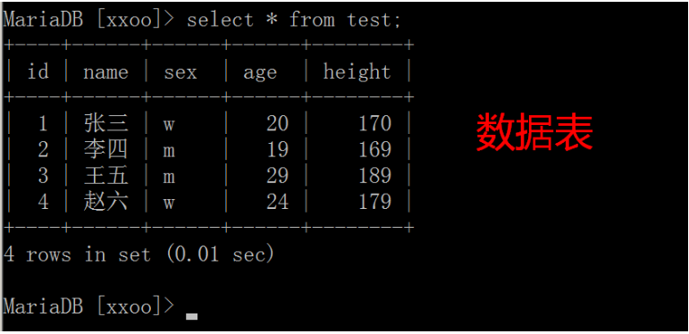
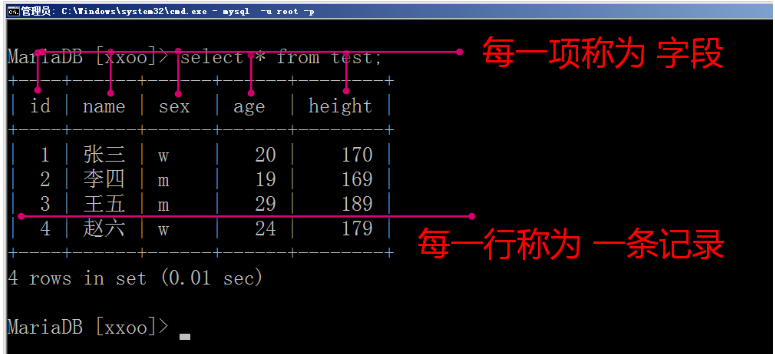
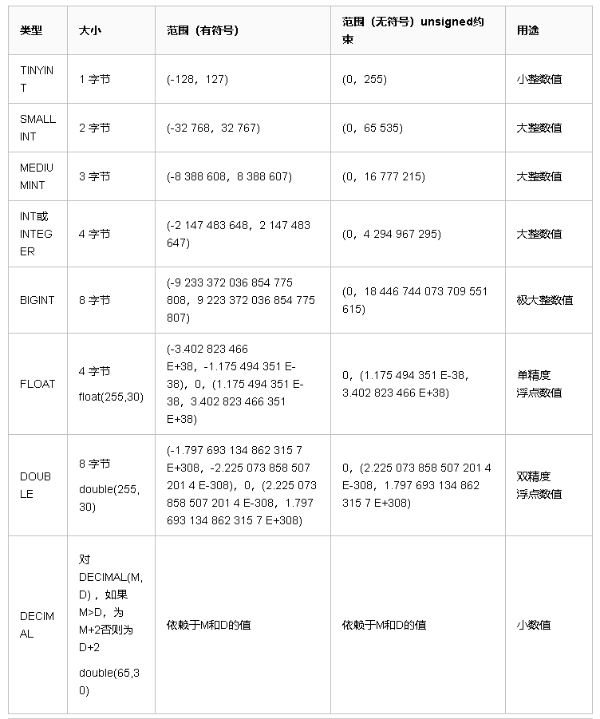
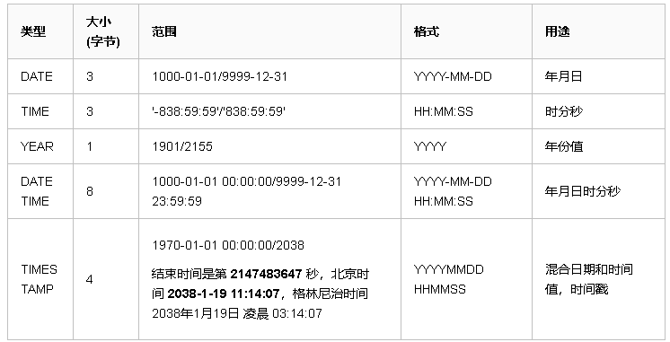
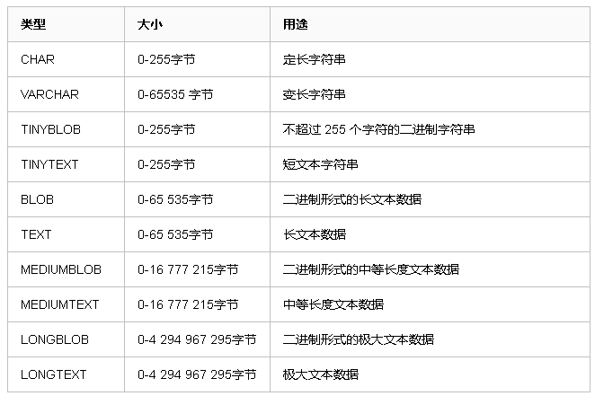
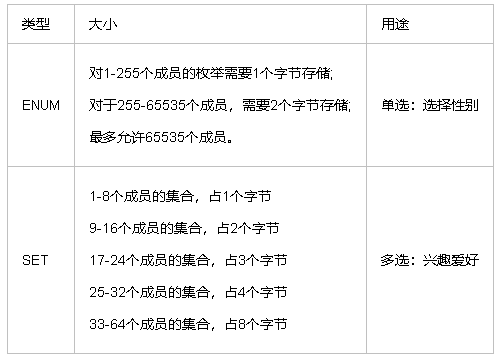

> ###  MySQL基础操作
>
> > 使用方法:
> >
> >  方式一: 通过图型界面工具,如 Navicat 等( 高级课使用 )
> >
> >  方式二: 通过在命令行敲命令来操作 ( 基础阶段使用 )
>
>  **SQL ( Structure query language ) 结构化查询语言**
>
> > SQL语言分为4个部分：DDL（定义）、DML（操作）、DQL（查询）、DCL（控制）
> >
> > 1、DDL语句 数据库定义语言： 数据库、表、视图、索引、存储过程，例如CREATE DROP ALTER
> > 2、DCL语句 数据库控制语言： 例如控制用户的访问权限GRANT、REVOKE
> > 3、DML语句 数据库操纵语言： 插入数据INSERT、删除数据DELETE、更新数据UPDATE
> > 4、DQL语句 数据库操纵语言：查询数据SELECT
> >
```
mysql数据库管理软件,记录事物一些数据特征:
由库,表,记录组成.
库相当于一个文件夹
表相当于一个文件
记录就是文件里面一条一条的内容
表中的成员属性就是一个一个字段
可以为每个项目建立一个数据库

关系型数据库:表与表之间有联系
比如:mysql,oracle,db2,sqlserver

非关系型数据库: key-value 键值对形式 没有表的概念
比如:redis,mongodb,memcache
```


>  **SQL语句中的快捷键**
>
>  > \G 格式化输出（文本式，竖立显示）
>  >
>  > \s 查看服务器端信息
>  >
>  > \c 结束命令输入操作
>  >
>  > \q 退出当前sql命令行模式
>  >
>  > \h 查看帮助
>
>  ### 操作数据库的步骤
>
>  **连接, 打开库, 操作, 关闭退出**
>
>  ### 1.通过命令行连接MySQL
>
>  
>
>  ### 数据库语法的特点
>
>  #### 1) SQL 语句可以换行, 要以分号结尾
>
>  
>
>  #### 2) 命令不区分大小写. 关键字和函数建议用大写
>
>  
>
>  #### 3) 如果提示符为 '> 那么需要输入一个'回车
>
>  
>
>  #### 4) 命令打错了换行后不能修改, 可以用 \c 取消
>
>  
>
>  ### 2. 数据库操作
>
>  查看数据库 **show databases;**
>
>  创建数据库 **create database 库名 default charset=utf8;**
>
>  删除数据库 **drop database 库名;**
>
>  打开数据库 **use 库名;**
>
>  ### 3. 数据表操作
>
>  #### 数据库管理系统中, 可以有很多`库`, 每个数据库中可以包括多张数据`表`
>
>  
>
>  #### 
>
>  查看表: **show tables;**
>
>  创建表: **create table 表名(字段名1 类型,字段名2 类型)engine=innodb default charset=utf8;**
>
>  创建表: 如果表不存在,则创建, 如果存在就不执行这条命令
>
>  **create table if not exists 表名(**
>
>  **字段1 类型,**
>
>  **字段2 类型**
>
>  **);**
>
>  删除表: **drop table 表名;**
>
>  表结构: **desc 表名;**
>
>  ### 4. 记录操作 增删改查
>
>  插入 单条数据:**insert into 表名(字段1,字段2,字段3) values(值1,值2,值3);**
>
>  插入多条数据:**insert into 表名(字段1,字段2,字段3) values(a值1,a值2,a值3),(b值1,b值2,b值3);**
>
>  查询 **select \* from 表名;**
>
>  **select 字段1,字段2,字段3 from 表名;**
>
>  **select \* from 表名 where 字段=某个值;**
>
>  修改 **update 表名 set 字段=某个值 where 条件;**
>
>  **update 表名 set 字段1=值1,字段2=值2 where 条件;**
>
>  **update 表名 set 字段=字段+值 where 条件;**
>
>  删除 **delete from 表名 where 字段=某个值;**
>
>  ### 退出MySQL
>
>  **exit;** 或者 **quit;**
>  ### 卸载MySQL
```
# ### mysql 卸载 
# (1) windows 卸载
关闭服务
cmd : mysqld remove
删除已经解压的文件夹
重启电脑

# (2) linux 卸载
sudo apt-get autoremove --purge mysql-server-5.7 
sudo apt-get remove mysql-common
sudo rm -rf /etc/mysql/  /var/lib/mysql   
#清理残留数据
dpkg -l |grep ^rc|awk '{print $2}' |sudo xargs dpkg -P  
sudo apt autoremove
sudo apt autoreclean
```
### 存储引擎场景:
```
InnoDB
用于事务处理应用程序，支持外键和行级锁。如果应用对事物的完整性有比较高的要求，在并发条件下要求数据的一致性，数据操作除了插入和查询之外，还包括很多更新和删除操作，那么InnoDB存储引擎是比较合适的。InnoDB除了有效的降低由删除和更新导致的锁定，还可以确保事务的完整提交和回滚，对于类似计费系统或者财务系统等对数据准确要求性比较高的系统都是合适的选择。

MyISAM
如果应用是以读操作和插入操作为主，只有很少的更新和删除操作，并且对事务的完整性、并发性要求不高，那么可以选择这个存储引擎。

Memory
将所有的数据保存在内存中，在需要快速定位记录和其他类似数据的环境下，可以提供极快的访问。Memory的缺陷是对表的大小有限制，虽然数据库因为异常终止的话数据可以正常恢复，但是一旦数据库关闭，存储在内存中的数据都会丢失。

#查看当前的默认存储引擎:
show variables like "default_storage_engine";
#更改表的存储引擎
alter table t1 engine = innodb;
```
### 数据类型

### 整型  浮点型



### # 时间类型:


### 字符串:


### 枚举&集合	


### 索引原理
```
# innodb和myisam的索引的存储方式是不同的
    # innodb 存储引擎 索引和数据都存在ibd文件中
    # myisam 把所有的索引全部单独存储,就是那个MYI文件

# 索引的数据结构使用的是b+树
    一个叶子节点也叫一个数据页,可以存多条数据,大概16k
    单条数据量越小,叶子节点存的数据量就会越大,需要的叶子节点就越少,
    这样的话,树的高度相对降低一些,查询的速度越快.
```
### 联合索引
```
联合索引:经常查询时候,几个字段要放在一起查,比如找名字:姓+名
name = 'xxx' and email = 'xxx'
create index 索引名 on 表明(字段1,字段2 ... )
create index name_email on t1(name,email);
```

### sql语句优化:
```
(1) 避免使用select *,
(2) 不确定表大小时候,先用count(*)查下数据.
(3) 创建表时尽量使用 char 代替 varchar
(4) 定长的字段放前面,变长的字段放后面.(尽可能小的改变树状结构高度)
(5) 组合索引代替多个单列索引
   （由于mysql中每次只能使用一个索引，所以经常使用多个条件查询时更适     合使用组合索引）
(6) 尽量使用短索引(小数据值)
(7) 重复少的字段值不适合做索引，例：性别不适合
(8) 使用连接（JOIN）来代替子查询(Sub-Queries)
```


# 导出数据库 [退出mysql时在操作]
```
mysqldump -uroot -p123456 db1 > db1.sql
mysqldump -uroot -p123456 db1 表1 表2 > ceshi01.sql
```
# 导入数据库 [登入mysql时在操作]
```
source ~/ceshi01.sql;
```