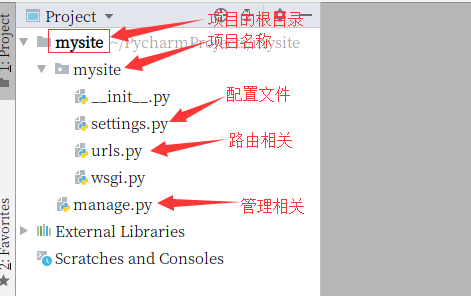
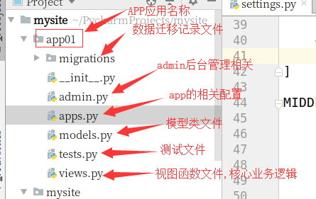
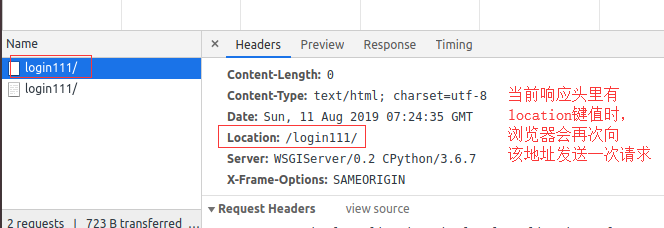
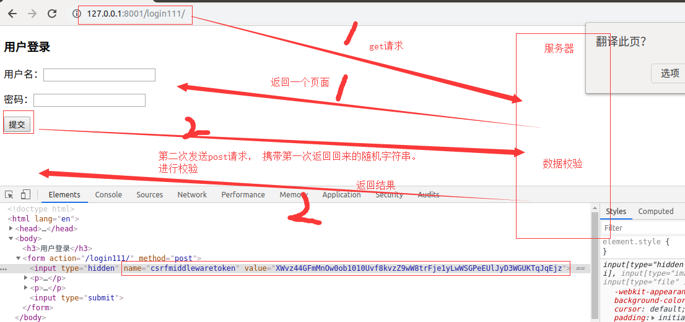

## L17

### 一. 今日概要

博客地址（web开篇）：<https://www.cnblogs.com/Michael--chen/p/10495057.html>

博客地址（基础）：<https://www.cnblogs.com/Michael--chen/p/10503456.html>

1. 介绍http协议
2. django的下载与简单使用
3. 路由层
4. 视图层
5. 模板层

### 二. 今日详细

1. http协议简介

2. MTV与MVC模型

3. django下载

   1. 命令行模式

      ```python
      pip3 install django
      # 指定版本
      pip3 install django==版本号
      
      # 如果网速非常慢,可以指定下载源
      pip3 install django -i https://pypi.doubanio.com/simple
      ```

   2. pycharm的模式

      file--->settings--->project--->点击+号,输入Django(选择版本)--->install

4. 新建一个Django项目(建议大家多使用命令行的模式)

   1. 命令行模式

      ```python
      django-admin startproject 项目名称
      ```

   2. pycharm模式

      file---> new project  ----> Django --->输入项目路径和名称-----> 选择环境 ---> create



5. 创建APP应用(推荐使用命令行)

   1. 命令行的模式

      ```python
      python3 manage.py startapp app名称
      ```

   2. pycharm创建

      在新建项目的时候,选择appname即可创建app

      

6. 启动Django项目

   1. 命令行的模式

      ```python
      python3 manage.py runserver                # 127.0.0.1:8000
      python3 manage.py runserver 80             # 127.0.0.1:80
      python3 manage.py runserver 0.0.0.0:8888   # 0.0.0.0:8888# 注意：要在manage.py同级目录执行命令
      ```

   2. pycharm启动项目

      右上角的绿伞三角按钮,实现项目的启动

      选择项目上的edit进行更改.

7. 路由层

   1. 无名分组

      ```python
      # 无名分组,按位置传参
          # re_path("^articles/([0-9]{4})/$", views.articles_year),
      ```

   2. 有名分组

      ```python
      # 有名分组， 按关键字传参
          # re_path("^articles/(?P<year>[0-9]{4})/$", views.articles_year),
      ```

   3. 路由分发

      include

      ```python
      path("app01/", include("app01.urls")),
      ```

   4. 反向解析

      1. 对当前的url设置路由别名

         ```python
         path('login/', views.login, name="Login"),
         ```

      2. 反向解析

         1. 在python代码里反向解析

            ```python
            from djagno.urls import reverse 
            
            url = reverse("路由别名")
            ```

         2. 在html里方向解析

            ```HTML
            url = ""
            ```

         3. 当反向有参数时

            1. python代码

               ```python
               url = reverse("路由别名", args=(111, 222)  # 应用于无名分组,按照位置传参
                             
               url = reverse("路由别名", kwargs={"key1": val1,...}  # 应用于有名分组,按照关键字传参
               ```

            2. HTML里反向

               ```HTML
               url = ""  # 无名分组
               
               url = ""  # 有名分组
               ```

   5. 名称空间

      背景: 统一个项目中,如果路由别名相同之后,会存在覆盖的现象.

      urls.py:

      ```python 
      path("app01/", include(("app01.urls", "app01"))),
      ```

      

      1. python代码里

         ```python
         url = reverse("名称空间名称:路由别名")
         ```

      2. html代码里

         ```html
         url = ""
         ```

8. 视图层

   1. request请求对象

      ```python 
      # request对象的常用属性
          # GET方式：
          # print(request.GET)
          # print(request.GET.get("name"))
      
          # < QueryDict: {'name': ['alex'], 'hobby': ['chui', 'la', 'tan']} >
          # request.GET.getlist("hobby")  # 获取多个值时，使用getlist方法。
      
          # request.POST 同上
      
          # request.body 原生的请求体里的内容
          b"name=alex&age=18"
      
          print(request.path)  # 获取当前请求的URL路径
      
          # print(request.method)  # 获取当前请求的方式
      
          # request对象常用的方法
          print(request.get_full_path())  # 获取当前请求的完整路径
      
          # 判断当前请求是否是ajax请求
          print(request.is_ajax())
      ```

   2. HttpResponse对象

      1. HttpResponse
      2. render
      3. redirect



9. 模板层

   1. 变量

      ```html
      {{ 变量的名称 }}
      
      列表用下标索引
      字典直接.key
      对象直接.属性或者方法
      ```

   2. 过滤器

      1. default  显示默认值
      2. length  返回对象的长度
      3. filesizeformat   格式化存储单位
      4. date 格式化日期
      5. truncatechars  对文本进行截断
      6. safe  使字符串有语义化，在页面进行渲染

   3. 标签

      1. for循环

         ```html
         
         	{{ i.xxx}}
         	{{ forloop.first }}
         
         ```

         for__empty

      2. if流程控制

         ```html
         
         	。。。
         
         	。。。
         
         	。。。
         
         ```

         对比之前的python的if

         ```python 
         if 条件:
             ...
         elif 条件:
         	...
         else:
             ...
         ```

      3. with 标签

         相当于定义一个中间变量使用

      4. csrf_token标签

         在form表单里生成一个隐藏的input标签，其中包含csrf_token,的随机字符串值，用于服务器进行校验使用。

         ```html
         <input type="hidden" name="csrfmiddlewaretoken" value="d8bM1SYfwtpiNFjPXa8MCq5TuZICmEkJJDlwbPQlGDUa6TzyhTFpLRwFUnzmDMHa">
         ```



 4. 自定制标签和过滤器

    1. 必须要保证app已经注册（在settings里）

    2. 在app下创建一个目录（必须叫templatetags）

    3. 在templatetags目录下创建一个.py 文件（文件名无所谓。如：my_tags.py）

    4. 在my_tags.py里写代码

       ```python 
       from django import template
       
       register = template.Library()   #register的名字是固定的,不可改变
       
       # 自定义过滤器,最多两个参数
       @register.filter
       def my_filter(v1, v2):
           
           return v1 * v2
       
       # 自定义标签
       @register.simple_tag
       def my_tag(v1, v2, v3, ...)：
       	return v1 * v2 * v3
       
       ```

    5. 调用阶段

       在html文件里，首先要加载my_tags.py文件

       ```html
       
       
       <p>{{ num1|my_filter:12 }}</p>
       
       <hr>
       <p></p>
       
       <hr>
       <p></p>
       
       ```

    6. 模板继承

       1. 提取一个基类模板（父模板）

          ```html
          <!DOCTYPE html>
          <html lang="en">
          <head>
              <meta charset="UTF-8">
              <title>Title</title>
              <!-- 最新版本的 Bootstrap 核心 CSS 文件 -->
              <link rel="stylesheet" href="https://cdn.jsdelivr.net/npm/bootstrap@3.3.7/dist/css/bootstrap.min.css" integrity="sha384-BVYiiSIFeK1dGmJRAkycuHAHRg32OmUcww7on3RYdg4Va+PmSTsz/K68vbdEjh4u" crossorigin="anonymous">
              <link rel="stylesheet" href="/static/css/index.css">
              
              
          </head>
          <body>
          
              <nav class="navbar navbar-inverse navbar-fixed-top">
                <div class="container-fluid">
                  <div class="navbar-header">
                    <button type="button" class="navbar-toggle collapsed" data-toggle="collapse" data-target="#navbar" aria-expanded="false" aria-controls="navbar">
                      <span class="sr-only">Toggle navigation</span>
                      <span class="icon-bar"></span>
                      <span class="icon-bar"></span>
                      <span class="icon-bar"></span>
                    </button>
                    <a class="navbar-brand" href="#">图书管理系统</a>
                  </div>
                  <div id="navbar" class="navbar-collapse collapse">
                    <ul class="nav navbar-nav navbar-right">
                      <li><a href="#">Dashboard</a></li>
                      <li><a href="#">Settings</a></li>
                      <li><a href="#">Profile</a></li>
                      <li><a href="#">Help</a></li>
                    </ul>
                    <form class="navbar-form navbar-right">
                      <input type="text" class="form-control" placeholder="Search...">
                    </form>
                  </div>
                </div>
              </nav>
          
              <div class="container-fluid">
                <div class="row">
                  <div class="col-sm-3 col-md-2 sidebar">
                    <ul class="nav nav-sidebar">
                      
                        
                    </ul>
                  </div>
                  <div class="col-sm-9 col-sm-offset-3 col-md-10 col-md-offset-2 main">
          
                  
                      <a href="#"><button class="btn btn-success">新增书籍</button></a>
                  
          
                  </div>
                </div>
              </div>
          
          
          
          
          </body>
          </html>
          ```

       2. 在子模板导入父模板

          ```html
          
          ```

       3. 在子模板对应的地方，使用自己的模板代码即可

          ```html
          
          
          <li><a href="/app02/book_list/">图书管理 <span class="sr-only">(current)</span></a></li>
                      <li class="active"><a href="/app02/publish_list/">出版社管理</a></li>
                      <li><a href="#">作者管理</a></li>
          
          
          
          <h2 class="sub-header">出版社列表</h2>
                    <div class="table-responsive">
                      <table class="table table-striped">
                        <thead>
                          <tr>
                            <th>#</th>
                            <th>Header</th>
                            <th>Header</th>
                            <th>Header</th>
                            <th>Header</th>
                          </tr>
                        </thead>
                        <tbody>
                          <tr>
                            <td>1,001</td>
                            <td>Lorem</td>
                            <td>ipsum</td>
                            <td>dolor</td>
                            <td>sit</td>
                          </tr>
                          <tr>
                            <td>1,002</td>
                            <td>amet</td>
                            <td>consectetur</td>
                            <td>adipiscing</td>
                            <td>elit</td>
                          </tr>
                          <tr>
                            <td>1,003</td>
                            <td>Integer</td>
                            <td>nec</td>
                            <td>odio</td>
                            <td>Praesent</td>
                          </tr>
                          <tr>
                            <td>1,003</td>
                            <td>libero</td>
                            <td>Sed</td>
                            <td>cursus</td>
                            <td>ante</td>
                          </tr>
                          <tr>
                            <td>1,004</td>
                            <td>dapibus</td>
                            <td>diam</td>
                            <td>Sed</td>
                            <td>nisi</td>
                          </tr>
                          <tr>
                            <td>1,005</td>
                            <td>Nulla</td>
                            <td>quis</td>
                            <td>sem</td>
                            <td>at</td>
                          </tr>
          
          
                        </tbody>
                      </table>
                    </div>
          
          ```

       4. 特殊情况：

          如果父模板中的，块中有初始代码，而子模板又想继续使用，请使用下面代码即可。

          ```html
          {{ block.super }}
          ```

### 三. 本周作业

1. 整理笔记，所有内容过一遍

2. 完成图书的展示(运用bootstrap美化)

   ```python
   class Book:
       def __init__(self, title, price, author, publisher):
           self.title = title
           self.price = price
           self.author = author
           self.publisher = publisher
   
   
   book1 = Book("三国演义", 200, "罗贯中", "南山出版社")
   book2 = Book("红楼梦", 130, "曹雪芹", "东莞出版社")
   book3 = Book("西游记", 150, "吴承恩", "南山出版社")
   book4 = Book("水浒传", 180, "施耐庵", "宝安出版社")
   
   books_list = [book1, book2, book3, book4]
   ```

   

