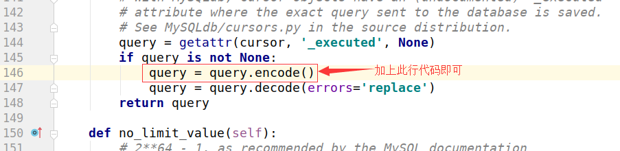

## L18

### 一. 今日内容

博客地址：<https://www.cnblogs.com/Michael--chen/p/10512919.html>

1. orm简介

2. 

   

2. django使用mysql的步骤：

   1. 创建mysql数据库（因为，orm最高只能操作到数据表）

      ```sql
      create database db_name default charset=utf8;
      ```

   2. 在settings里配置

      ```python 
      DATABASES = {
          'default': {
              'ENGINE': 'django.db.backends.mysql',  # 指定引擎
              'NAME': 'L18',  # 数据库名称
              'HOST': '127.0.0.1',  # ip地址
              'PORT': 3306,  # 端口
              'USER': "root",  # 用户名
              'PASSWORD': "123",  # 密码
          }
      }
      ```

   3. 在settings同级目录下的init.py里配置

      ```python
      import pymysql  # 没有自己安装模块
      pymysql.install_as_MySQLdb()
      ```

   4. 在models.py写模型类

      class Book(models.Model):
          title = models.CharField(max_length=32)
          price = models.DecimalField(max_digits=5, decimal_places=2)  # 999.99
          pub_date = models.DateField()

   5. 执行数据库迁移命令

      1. python3 manage.py makemigrations  # 记录models的变更记录

         报错1:

         ```python
           File "/home/moluo/.local/lib/python3.6/site-packages/django/db/backends/mysql/base.py", line 36, in <module>
             raise ImproperlyConfigured('mysqlclient 1.3.13 or newer is required; you have %s.' % Database.__version__)
         django.core.exceptions.ImproperlyConfigured: mysqlclient 1.3.13 or newer is required; you have 0.9.3.
         
         ```

         解决:

         

         报错2:

         ```python
           File "/home/moluo/.local/lib/python3.6/site-packages/django/db/backends/mysql/operations.py", line 146, in last_executed_query
             query = query.decode(errors='replace')
         AttributeError: 'str' object has no attribute 'decode'
         
         ```

         解决:

         

      2. python3 manage.py migrate  # 才能同步到数据库

3. 新增操作
   1. 实例对象的方式,要save
   2. 通过ORM提供的objects提供的方法 create来实现

4. 多表的建模
   1. 一对多的新增
   2. 多对多的新增
   3. 关联管理器
      1. 大前提:
         1. 一对多关系时,出版社管理书籍时.
         2. 多对多关系时,双方都可以.
      2. 方法合集
         1. add
         2. create
         3. clear
         4. remove
         5. set

5. 多表的查询
   1. 基于对象的查询
   2. 基于双下划线的查询
   3. 聚合查询aggregate
   4. 分组查询annotate
   5. F对象
   6. Q对象
6. ajax相关


1. 普通的ajax请求
2. 携带参数的ajax请求

3. 上传json数据时:json

```python
request.POST   # 没有值
request.body   # 有值
request.FILES  # 没有值
```

4. 上传文件时:multipart/form-data

```python
request.POST   # 有值
request.body   # 报错
request.FILES  # 有值
```

### 二. 本周作业

1. 图书管理运用mysql数据库
2. 删除图书时,加上一个ajax删除

预习博客地址:

coolie与session:<https://www.cnblogs.com/Michael--chen/p/10568956.html>

中间件:<https://www.cnblogs.com/Michael--chen/p/10574777.html>

用户认证组件:<https://www.cnblogs.com/Michael--chen/p/10590503.html>

FBV与CBV:<https://www.cnblogs.com/Michael--chen/p/10952134.html>

分页器:<https://www.cnblogs.com/Michael--chen/p/10965465.html>

admin:<https://www.cnblogs.com/Michael--chen/p/10971030.html>

Xadmin:<https://www.cnblogs.com/Michael--chen/p/10971046.html>

