## L19

### 一. 今日概要

博客地址(cookie与session:<https://www.cnblogs.com/Michael--chen/p/10568956.html>

中间件:<https://www.cnblogs.com/Michael--chen/p/10574777.html>

用户认证组件:<https://www.cnblogs.com/Michael--chen/p/10590503.html>

1. cookie与session
2. 中间件
3. session源码解析
4. 用户认证组件

### 二. 今日详细

1. cookie与session

   1. cookie保存在浏览器端的键值对

   2. session 保存在服务器端的数据(django_session)

      注意: session表中的信息,保存的时浏览器的信息,而不是用户的信息.

2. 用户验证码

   点击图片更一张

   ```JavaScript
   $("#img").click(function(){
       $(this).prop("src", "/valid_img/?pk=" + Math.random())
   })
   ```

3. 中间件

   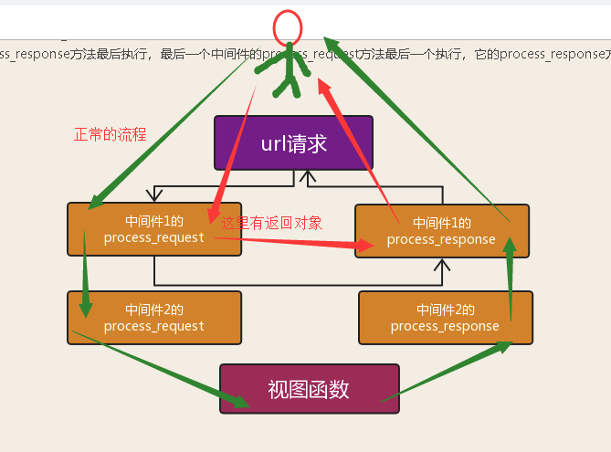

   1. process_request方法(***)

      在视图之前执行,按照注册的顺序执行.

      默认返回值为None(常规下不用写返回值)

      有返回对象时,下面的方法(其他后面的中间件的process_request方法)和视图不执行,直接到当前类下的process_response方法返回.

   2. process_response方法(***)

      在视图之后执行,按照注册的倒序执行

      必须要有返回值(response),否则,会报错.

      

   3. process_view方法

      在视图之前执行,按照注册的顺序执行

      默认返回值为None,当你返回响应对象时,后面的process_view和视图函数不会执行.直接到最后一个中间件的process_response方法返回.

      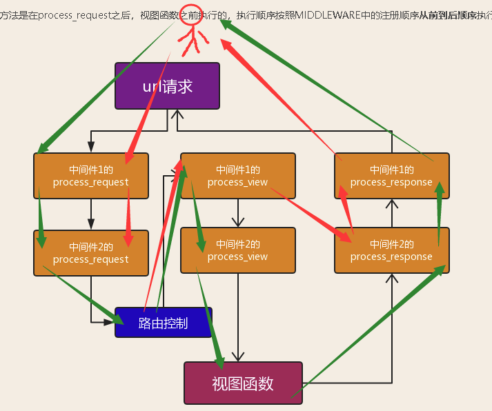

   4. process_exception方法

      在视图之后执行,按照注册的倒序执行.

      默认返回值为None, 当你返回响应对象时,前面的process_exception不会执行.直接到最后一个中间件的process_response方法返回.

      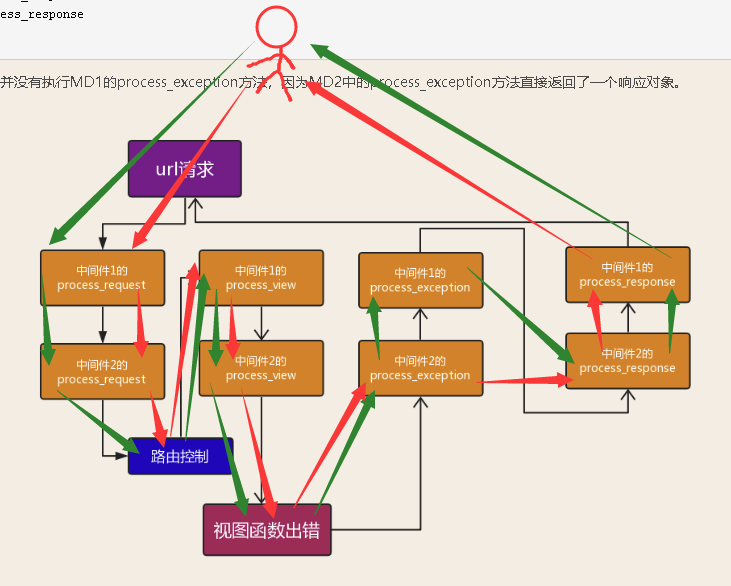

4. session源码解析步骤

   1. process_request

      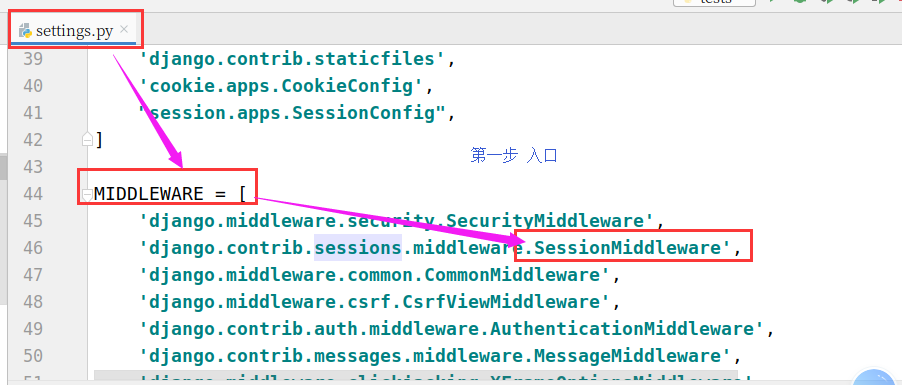

   2. 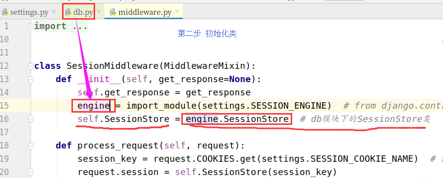

   3. 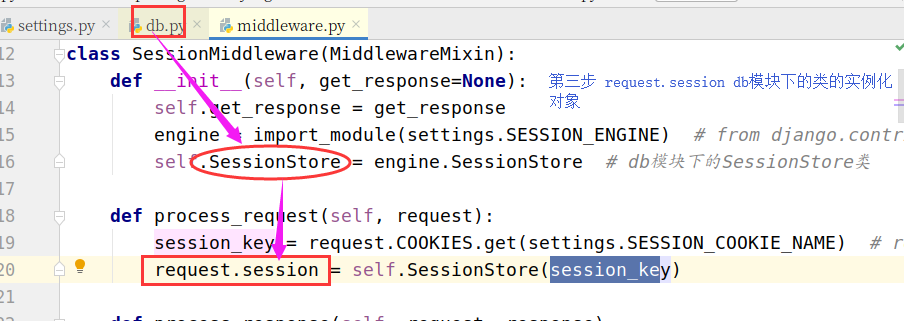

   4. 视图层(request.session['is_login'] = True)

      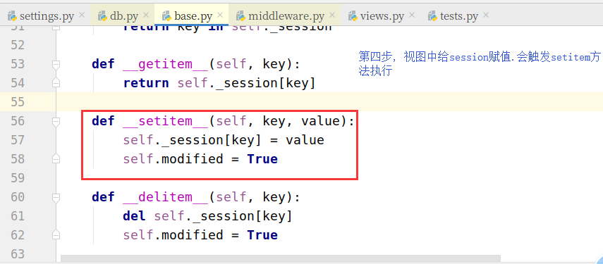

   5. 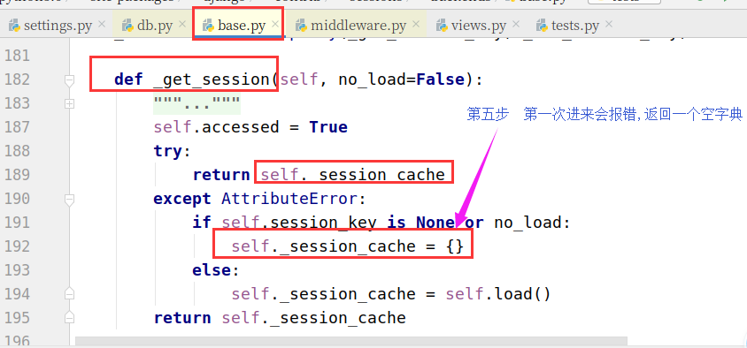

   6. process_response 方法

      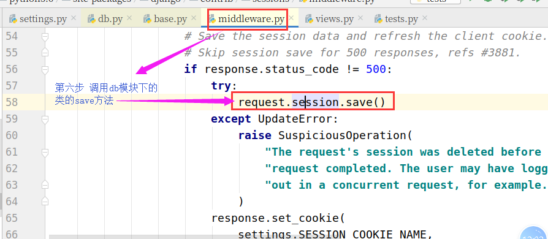

   7. 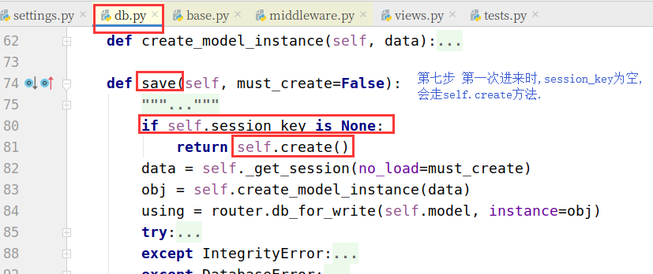

   8. 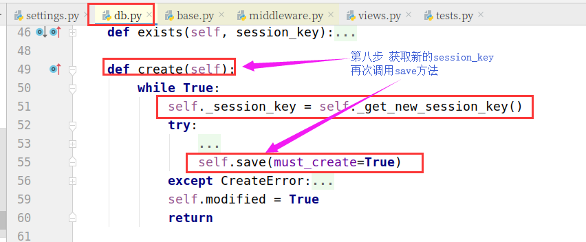

   9. 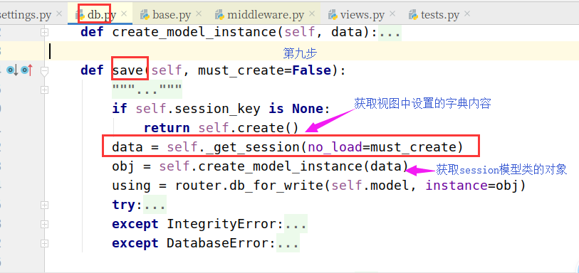

   10. 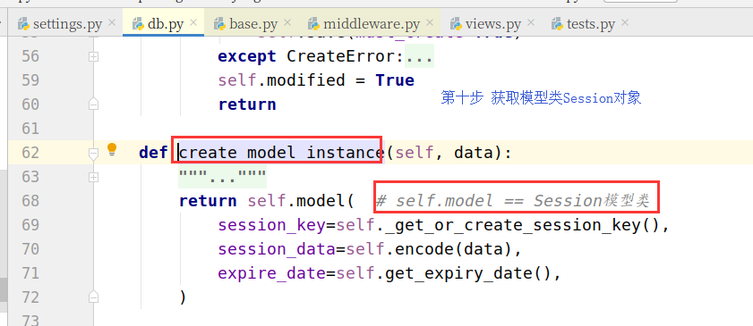

   11. 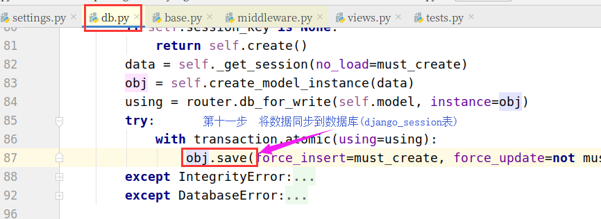

   12. 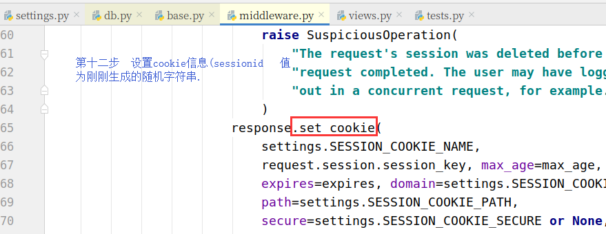

5. 用户认证组件

   大前提: 必须要使用Django自带auth_user表

   创建用户:

   - create   创建普通用户,密码明文(用户通过auth认证时,不能通过)
   - create_user  创建普通用户, 密码密文(***)
   - create_superuser 创建超级管理员用户,密码密文.

   1. 完成登录校验案例

      1. 自己写装饰器

         ```python
         def login_required(func):
             def inner(request, *args, **kwargs):
                 if not request.user.is_authenticated:
                     path = request.path
                     print(path)
                     return redirect("/auth_demo/login/?next=%s" % path)
                 return func(request, *args, **kwargs)
             return inner
         ```

      2. 使用auth模块提供的login_required装饰器

         注意: 在settings里修改(用户级别的setting的优先级大于global_settings)

         ```python
         LOGIN_URL = '/auth_demo/login/'  # 是你自己的login的url
         ```

   2. authenticate方法

      传入用户名和密码,判断当前用户是否是合法用户,合法则返回当前auth_user表对象.反之,返回为None

   3. login方法

      传入request和user(上一步合法的User对象)

      - 写入session信息
      - request.user = 当前登录的用户对象

   4. logout方法

      传入request

      - request.session.flush()  # 删除session信息

      - request.user = 匿名用户

   5. is_authenticated属性

      判断当前用户是否是登录状态

      ```python
      request.user.is_authenticated # 返回布尔值
      ```

   6. check_password

      校验原密码是否一致,返回布尔值

   7. set_password

      更新当前对象的密码

### 三. 本周作业

1. 练习cookie与session的相关代码,加深理解
2. 查看session的源码.理解session原理(带着一条主线去看源码)
3. 给图书管理系统加上(注册/修改密码/登录限制)


