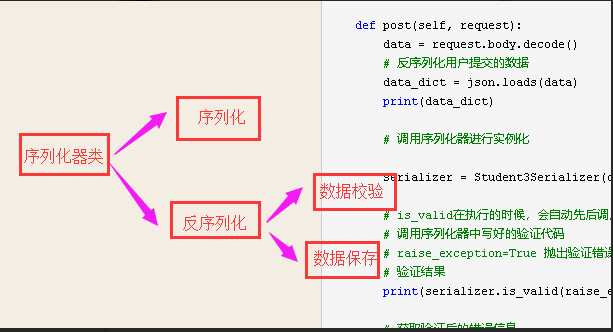

## L21

### 一. 今日内容

博客地址(序列化器):<https://www.cnblogs.com/Michael--chen/p/11222143.html>

博客地址(视图相关):<https://www.cnblogs.com/Michael--chen/p/11235456.html>

博客地址(路由与扩展功能):<https://www.cnblogs.com/Michael--chen/p/11241840.html>

1. web应用开发模式

   1. 前后端不分离
   2. 前后端分离

2. api规范

   1. rpc
   2. restful
      1. get     http://www.student/     #   获取所有数据
      2. post    http://www.student/     #   新增数据
      3. get    http://www.student/pk/     #   获取一条数据
      4. put   http://www.student/pk/     #   修改一条数据
      5. delete   http://www.student/pk/     #   删除一条数据

3. 序列化(来反去序)

   1. 请求来时,进行反序列化
   2. 响应回去时,镜像序列化

4. 环境的配置

   1. 创建虚拟环境

      ```python
      mkvirtualenv drfdemo -p python3
      ```

   2. 安装相关的库

      ```python
      pip install django
      pip install djangorestframework
      pip install pymysql
      ```

5. 序列化

   1. 序列化

      ```python
      def get(self, request, pk):
              student_obj = Student.objects.get(pk=pk)
      
              serializer = StudentSerializer(instance=student_obj)
      
              print(serializer.data)
      
              return JsonResponse(serializer.data)
      ```

   2. 反序列化

      

      1. 数据校验

         1. 内置选项
         2. 自定义方法(注意方法名称不是随便写的"validate_<字段>" 或者 "validate")
         3. 自定义函数("validators=[验证函数１,验证函数２...]")

      2. 数据保存

         1. create方法
         2. update方法

         注意: 当我们实例化序列化器对象时:

         - 没有传递instance参数时, 调用save(),会触发序列化器的create方法,完成新增.
         - 传递instance参数时, 调用save(), 会触发序列化器的update方法,完成更新操作.

   3. 模型类序列化器

      第一部分的字段声明可省略

      第四部分的数据保存,可以省略

      ```python
      class Meta:
              model = Student
              # fields = "__all__"  # 表示引用所有字段
              fields = ["id", "name", "age", "class_null", "is_18"]  # is_18 为自定制字段，需要在models里自定义方法。
              # exclude = ["age"]  # 使用exclude可以明确排除掉哪些字段, 注意不能和fields同时使用。
              # 传递额外的参数，为ModelSerializer添加或修改原有的选项参数
              extra_kwargs = {
                  "name": {"max_length": 10, "min_length": 4, "validators": [check_user]},
                  "age": {"max_value": 150, "min_value": 0},
              }
      
      ```

6. 视图类

   1. APIView

      封装了request

      request.data直接取到用户提交的数据

   2. GenericAPIView

      在类下定义类属性

      queryset = 模型类.objects.all()

      serializer_class = 序列化器类名

      多出的方法:

      - 获取所有queryset     self.get_queryset()
      - 获取一个对象  self.get_object() 注意:形参必须叫pk
      - 获取序列化器类名  self.get_serializer()

   3. 五个视图扩展类(必须和GenericAPIView配合使用)

      1. ListModelMixin
      2. CreateModelMixin
      3. RetrieveModelMixin
      4. UpdateModelMixin
      5. DestroyModelMixin

   4. 扩展子类(不需要自己写请求方法了)

      1. ListAPIView      获取所有数据
      2. CreateAPIView   新增数据
      3. RetrieveAPIView       获取一条数据
      4. UpdateAPIView        更新一条数据
      5. DestorAPIView        删除一条数据

7. 视图集

   1. ViewSet

      重写了as_view 方法,可以字典{"请求方式": "对应的方法名称"}

   2. GenericViewSet

   3. ModelViewSet

   4. ReadOnlyModelViewSet

8. 路由类

   路由类一定要配合视图集使用

   ```python
   # 路由类默认只会给视图集中的基本5个API生成地址[ 获取一条，获取多条，添加.删除,修改数据 ]
   from rest_framework.routers import DefaultRouter
   # 实例化路由类
   router = DefaultRouter()
   # router.register("访问地址前缀","视图集类","访问别名")
   # 注册视图视图集类
   router.register("student7", views.Student7ModelViewSet)
   
   print(router.urls)
   # 把路由列表注册到django项目中
   urlpatterns += router.urls
   ```

9. 使用多个序列化器类

   1. 视图类使用多个序列化器类

      通过http请求方式判断

   2. 视图集使用多个序列化器类

      通过执行的方法名称判断

10. 扩展功能(了解即可,整理好笔记,使用手册)

    1. 认证
    2. 权限
    3. 限流
    4. 过滤
    5. 排序
    6. 分页

### 二. 本周作业

1. 整理一份思维导图(视图相关)
2. 把课上代码实现,并且看一下源码